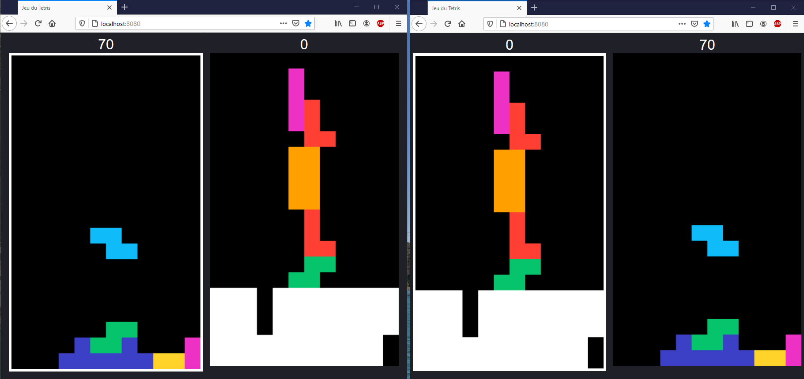

# Tetris
Tetris est un jeu vidéo de puzzle dont le but est de réaliser des lignes complètes en déplaçant des pièces de formes différentes appelées tétrominos, qui tombent depuis le haut de l'écran. Les lignes complétées disparaissent libèrant de l'espace dans la grille tout en rapportant des points (10 par ligne complète). Le jeu s'arrête quand un des tetrominos ne peut plus être placé dans l'écran car il dépasse de la grille.

Le mode multi-joueur de tetris reprend les règles du jeu solo précisée ci-dessus. La seule différence vient de l'interaction entre les parties des joueurs puisque la complétion d'une ligne chez l'un des joueur entraînera l'envoi de cette ligne (dont une case a été aléatoirement supprimée) chez l'autre joueur qui verra donc l'ensemble de sa grille monter d'une case. Les lignes s'additionnent, il est donc possible d'envoyer 2,3 voire plus de lignes à son adversaire, d'autant que l'ajout des lignes à lieu lorsque l'adversaire pose un tetrominos.

## Instructions d'installation :
Pour jouer à notre tetris multijoueur, suivre les étapes suivantes :
* Télécharger le code source sur le dépôt GitLab 
* Télécharger Node.js 

## Mode d'emploi :
Afin d'activer le mode multi-joueur, le serveur Node.js doit être démarré. Les étapes à suivre sont les suivantes :
* Se placer dans le dossier contenant le code et ouvrir l'invite de commandes. OU Lancer l'invite de commandes et se déplacer vers le dossier contenant le code en utilisant le mot clé "cd" (faire cd Documents => cd Info => cd Tetris pour se déplacer vers /Documents/Info/Tetris)
* Lancer le serveur en tapant "node serveur.js" dans le terminal.
* Lancer un navigateur web et entrer l'adresse "localhost:8080"

La fenêtre suivante devrait apparaître :

Le serveur et l'adresse étant locaux, le mode multi-joueur doit être simulé. Pour cela, ouvrez un deuxième onglet et rendez-vous à l'adresse "localhost:8080". Les écrans des deux joueurs sont affichés sur chaque fenêtre. En plaçant côte à côte les fenêtres des 2 joueurs, on obtient :

## Cahier des charges fonctionnel :
Les fonctionnalités suivantes ont été implémentées.

### Mouvements de base du tetrominos
Trois déplacements sont possibles : déplacements vers la gauche, la droite et le bas. Ces mouvements sont respectivement reliés aux touches ← , → et ↓ du clavier. Il est également possible de tourner la pièce dans le sens horaire avec la touche Z et anti-horaire avec la touche A.

### Chute automatique du tetrominos
A bout d'un intervalle de temps fixé, la pièce chute d'une case.

### Gestion des collisions
Les collisions avec les pièces et les parois sont repérées et peuvent aboutir au placement de la pièce si le contact se fait sur la partie basse de la pièce.

### Génération automatique de nouvelles pièces
Dès qu'une pièce est placée, une nouvelle pièce aléatoirement choisie parmi les pièces disponibles est affichée et le joueur en prend le contrôle.

### Suppression des lignes pleines et ajout des lignes chez l'adversaire
Dès qu'une ligne pleine est repérée, elle est supprimée et le nombre de lignes remplies lors du positionnement de la dernière pièce est envoyé au serveur. Celui-ci envoie alors à l'autre joueur les lignes, qui sont ajoutées à sa grille de jeu. Pour récompenser la suppression multiple de lignes, les nombre de lignes envoyées à l'adversaire est de 2nb lignes suppr - 1 . Lorsque les lignes sont envoyées en même temps, la case vide de la lignes ajoutées à l'adversaire est de même indice. La suppression d'une ligne augmente le score du joueur de 10 points, le score de chaque joueur est affiché au dessus des grilles.

### Contrôle de défaite
Un joueur perd la partie soit lorsqu'il reçoit une ligne qui fait dépasser ses pièces du haut de la grille soit lorsqu'une nouvelle pièce est générée et qu'elle entre directement en contact avec une pièce déjà placée. A ce moment, un signal de défaite est envoyé au serveur qui communique à l'autre joueur sa victoire. Un message "Victoire" ou "Défaite" apparaît sur les écrans des deux joueurs. La partie est mise en pause (les touches ne produisent plus de déplacements des pièces).

### Possibilité de relancer une partie après une victoire/défaite
Après la mise en pause du jeu suite à une victoire/défaite, les joueurs peuvent appuyer sur la touche R afin de relancer une partie avec leur adversaire.

### Possibilité de jouer plusieurs parties en parallèle
Le nombre de joueur n'est pas limité. Les deux premiers joueurs connectés sont placés dans la même partie, les troisième et quatrième également, etc. Lorsque notre adversaire est déconnecté, il est possible de continuer à jouer seul si le nombre de joueurs connectés est impair et si ce nombre est pair, alors un nouvel adversaire nous est proposé.

## Détails techniques : 

- un serveur en nodejs
- un canvas avec html et js 

